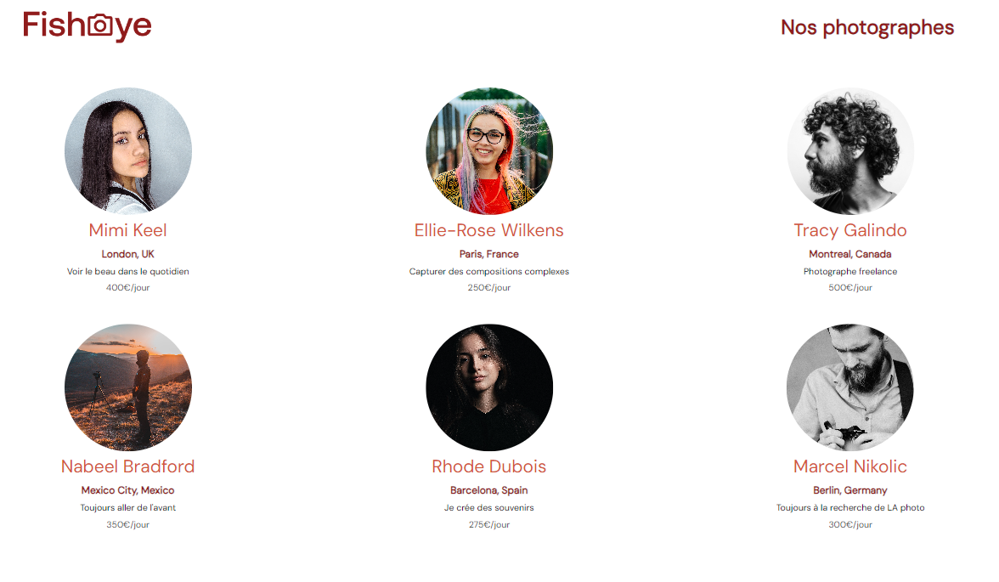

<a name="readme-top"></a>
<!-- PROJECT LOGO -->
<br />
<div align="center">
  <a href="">
    
  </a>

<!-- TABLE OF CONTENTS -->
<details>
  <summary>Table des matières</summary>
  <ol>
    <li><a href="#a-propos-du-projet">À propos du projet</a></li>
    <li><a href="#langagesutilises">langages Utilisés</a></li>
    <li><a href="#missions">Missions</a></li>
    <li><a href="#installation">Installation</a></li>
    <li><a href="#contact">Contact</a></li>
  </ol>
</details>


<!-- ABOUT THE PROJECT -->
## À propos du projet

Fish Eye est le projet 6 de ma formation OpenClassroom, dont la mission est le développement d'un site web pour une plateforme d’artistes.

L'accent est mis sur la création d'une application web accessible, modulaire et utilisant des design patterns en JavaScript (Factory Method).

La tâche consistait à intégrer diverses fonctionnalités telles que la récupération et l'affichage des données, la navigation entre les pages des photographes, une modale de contact, une LightBox pour les médias, et la gestion des likes. 

L'accessibilité était une priorité absolue dans ce projet. 

 

## Langages utilisés et autres technologies utilisées


## Missions

* Accessibilité
* Factory Method
* JavaScript Vanilla


## Installation

1. Clonez le repository de l'application
   ```sh
   git clone https://github.com/AurelieDuynslaeger/Projet-6-FishEye---Openclassrooms.git
   ```

2. Lancez l'application avec Live Server !
  
## Contact

Aurélie D. - [GitHub](https://github.com/AurelieDuynslaeger/)

<!-- MARKDOWN LINKS & IMAGES -->

[html.com]: https://img.shields.io/badge/-HTML-f06529?style=flat&logo=html5&logoColor=fff
[html-url]: https://html.com/
[css.com]: https://img.shields.io/badge/-CSS-264de4?style=flat&logo=css3&logoColor=fff
[css-url]: https://www.w3.org/Style/CSS/
[javascript.com]: https://img.shields.io/badge/-JavaScript-f6ff00?logo=JavaScript&logoColor=fff
[javascript-url]: https://www.javascript.com/


